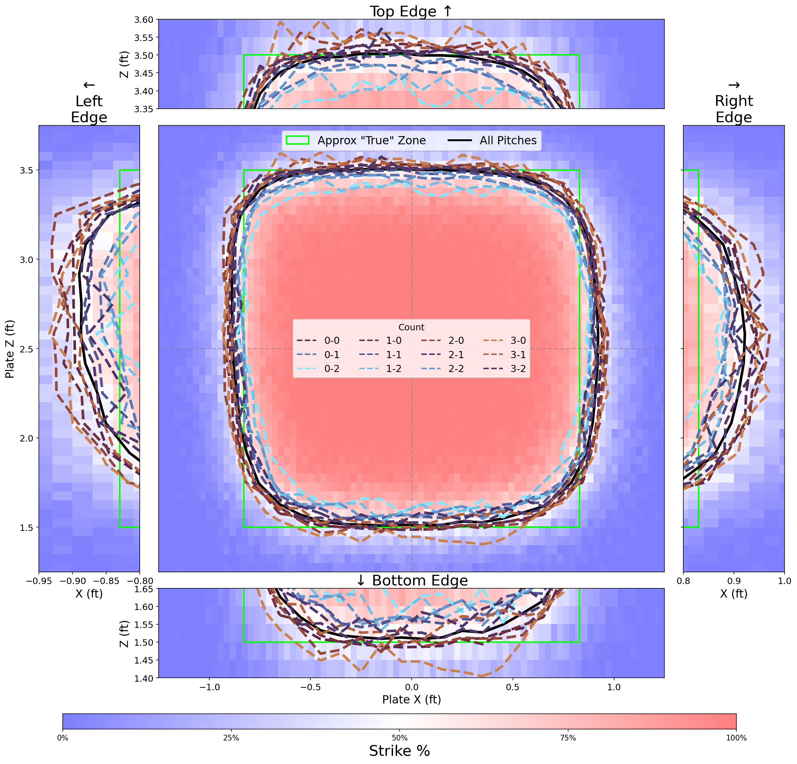
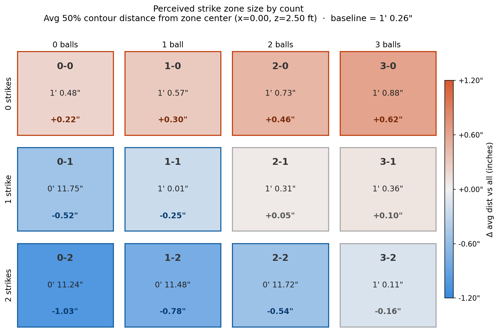

**Data** 

- MLB Statcast data (2023-2025 seasons)
- ~1.1 million called pitches (no swings)
- Downloaded via `pybaseball` library

`scripts/download_years.py` fetches the data, `scripts/create_heatmaps.py` generates some preliminary plots, and `scripts/strike_zone_analysis.ipynb` contains the full plotting script with some customization options.

**Strike probability contours by count** (`plots/count_based_strikezone_analysis/strike_probability_all_contours.png`)

The plot shows the 50% strike probability contour for each count:
- Black line = all pitches combined
- Blue contours = pitcher-friendly counts (0-2, 1-2, etc.)
- Red contours = hitter-friendly counts (3-0, 2-0, etc.)
- Green box = theoretical MLB strike zone

The zoom panels on each edge show subtle differences in how umpires call the zone.

**Per-count zone size grid** (`plots/count_based_strikezone_analysis/count_zone_size_grid.png`)

This grid shows the average distance from zone center to the 50% contour for each count, compared to the overall baseline.

Pitcher-friendly counts (like 0-2) have a **smaller** perceived zone, while hitter-friendly counts (like 3-0) have a **larger** zone. The difference is ~0.15 feet (almost 2 inches) between the extremes.
